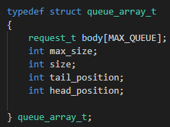
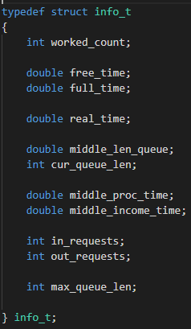

# Отчет по ЛР-5

### Вариант 22.

#### Хетагуров Павел Иу7-35Б

### 1. Описание условия задачи

**Цель:** отработка навыков работы с типом данных «очередь»,
представленным в виде одномерного массива и односвязного линейного
списка. Сравнительный анализ реализации алгоритмов включения и
исключения элементов из очереди при использовании двух указанных
структур данных. Оценка эффективности программы (при различной
реализации) по времени и по используемому объему памяти.

**Условие задачи:** Заявки поступают в "хвост" очереди по случайному закону с интервалом времени **Т1**, равномерно распределенным **от 0 до 6 единиц времени (е.в.)**.
В ОА они поступают из "головы" очереди по одной и обслуживаются также
равновероятно за время **Т2 от 0 до 1 е.в**. Каждая заявка после ОА вновь
поступает в "хвост" очереди, совершая всего 5 циклов обслуживания, после
чего покидает систему. (Все времена – вещественного типа) В начале
процесса в системе заявок нет.
Смоделировать процесс обслуживания до ухода из системы первых 1000
заявок, выдавая после обслуживания каждых 100 заявок информацию о
текущей и средней длине очереди, а в конце процесса - общее время
моделирования и количестве вошедших в систему и вышедших из нее заявок,
количестве срабатываний ОА, время простоя аппарата.
По требованию пользователя выдать на экран адресов элементов очереди при удалении и
добавлении элементов. Проследить, возникает ли при этом фрагментация
памяти.
#### ТЗ и внешняя спецификация

**Исходные данные и результаты (типы, форматы, способ передачи, ограничения):**
**Исходные данные**:

1. Пункт меню.
2. Вещественное число (при добавлении элемента в одну из очередей)
**Способ передачи**: Ввод в консоль (стандартный поток ввода)

**Ограничения**:
  1. Вещественное число должно быть корректно

**Выходные данные:**

В зависимости от выбранных пунктов.
1) Пункт `Print queue list`
Выводит в консоль элементы очереди на списке и соответствующие им адреса в две колонки, начиная с головы
2) Пункт `Print queue array`
Выводит элементы очереди на массиве начиная с головы
3) Пункт `Print free zone`
Выводит свободную область для очереди на списке
3) Пункт `Modeling array` и `Modeling list` 
Запускает моделирование (по заданию) и выводит результаты (Реальное время моделирования, полное время в условных еденицах времени, время простоя в условных еденицах, среднюю длину очереди, длину очереди на конец моделирования, кол-во вошедших заявок, кол-во вышедших заявок, среднее время обработки заявки, средний интервал прибытия новой заявки, кол-во срабатываний автомата, уникальные использованные ячейки памяти (для списка))

**Способ обращения к программе**: Запуск app.exe, ввод с клавиатуры

**Описание возможных аварийных ситуаций и ошибок пользователя:**

1. Некорректный ввод.
2. Невозможность выделения памяти.
3. Невозможность добавления элемента (переполненная очередь)
4. Невозможность распечатать очередь (пустая очередь)

### 2.Описание внутренних структур данных

**Описание полей**
Узел используется для очереди на списке

* .data - указатель на данные
* .next_node - указатель на следующий узел
Данная структура выбранна, так как является базовой для очереди на списке.

Очередь на списке

* .head_node  - Указатель на голову очереди. (Под головой понимается элемент, к которому есть доступ)
* .tail_node - Указатель на хвост стека. (Под хвостом понимается последний добавленный элемент)
* .size - Кол-во узлов. (Кол-во элементов позволяет легче обрабатывать очередь. Хотя в общем случае можно ориентироваться на нулевой указатель)

* .addresses - Массив свободных адресов.
* .max_size - Кол-во элементов, помещающееся в выделенную область
* cur_size - Текущее заполнение массива
Структура выбрана, так как позволяет хранить и обрабатывать адреса свободных ячеек памяти, что необходимо по заданию

Очередь на массиве (кольцевая)

* .body - Массив данных типа request_t
* .max_size - Ограничение на кол-во элементов
* .size - Текущий размер очереди
* .tail_position - Текущая индекс хвоста очереди
* .head_positin - Текущий индекс головы очереди

* .data - Время входа в цикл
* .count_of_cycle - Кол-во пройденных циклов обработки

* .data - Время входа в цикл
* .count_of_cycle - Кол-во пройденных циклов обработки
#### 4. Оценка алгоритма.

Сложность доступа к верхнему элементу не зависит от реализации O(1)
Кол-во памяти зависит от кол-ва данных n.

### 3.Функциональные тесты
|  Исходные данные |  Выходные |  Описание теста |
| --- | --- | --- |
| Данные некоректного формата | Wrong input |  Проверка ввода |
| Пустая очередь | Queue is empty | Печать пустой очереди |
| Добавление в заполненную очередь | Queue is full | Переполнение стека |
| Удаление из пустой очереди | Queue is empty | Пустая очередь |

### 5. Вывод и сравнение
Тесты скорости
Linux (Debian)

Windows 10

Скорость различается (см. вывод)
Результаты в условных временных еденицах примерно одинаковы

Дефрагментация:

Linux (Debian)

Windows 10

**Вывод** : Очередь, реализованная через список работает в 2 раза медленнее, чем очередь, реализованный через массив. Уровень дефрагментации различается на разных системах.
При небольшом кол-ве данных эффективнее использовать массив, так как скорость обработки значительно выше по сравнению со списком.
При большом или неизвестном кол-ве данных данные не помещаются в массив, и, жертвуя скоростью обработки и использованной памятью (+ хранение ссылок на узлы) приходиться реализовывать списком.

### 5. Вопросы
**Что такое очередь?**
Очередь - это структура данных, работающая по системе FIFO (First In First Out)
и допускающая две операции: 
1. pop - удаление из головы
2. push - добавление в хвост

**Каким образом, и какой объем памяти выделяется под хранение очереди при
различной ее реализации?**
При хранении очереди в виде массива сразу выделяется количество памяти n * sizeof(elem), где n - кол-во элементов + память на хранение индекса головы, хвоста и размера очереди

При реализации в виде списка помимо n * sizeof(elem) память расходуется на указание следующего элемента очереди.

**Каким образом освобождается память при удалении элемента из очереди при
ее различной реализации?**
При реализации списком полностью освобождается узел с данными, а при реализации массивом память не удаляется (просто сдвигается указатель на голову)

**Что происходит с элементами очереди при ее просмотре?**
Удаляются из головы и добовляются в хвост

**Каким образом эффективнее реализовывать очередь. От чего это зависит?**
Если важна скорость и объем данных известен и мал, то используется массив, из-за большей скорости
Если объем данных неизвестен или достаточно велик, то испоьзуется список

**Что такое фрагментация памяти?**
Выделение блоков памяти не последовательно
**На что необходимо обратить внимание при тестировании программы?**
Переполнение очереди
Соответствие теоритического время моделрования полученному
**Каким образом физически выделяется и освобождается память при
динамических запросах?**
Менеджер памяти размечает блок памяти как выделенной для программы, следовательно он не может выделятся для других программ. При освобождении менеджер памяти помечает выделенную память как свободную и может отдавать её другим программам (не гарантируется неизменяемость данных)