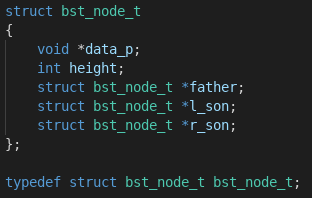
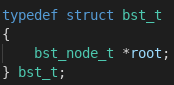
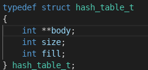
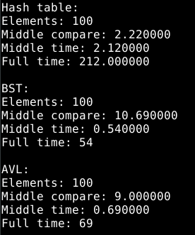
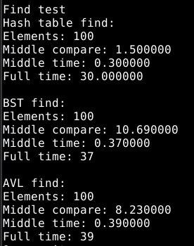

# Отчет по ЛР-6

### Вариант 22.

#### Хетагуров Павел Иу7-35Б

### 1. Описание условия задачи

**Цель:** получить навыки применения двоичных деревьев, реализовать основные операции над деревьями: обход деревьев, включение, исключение и поиск узлов; построить и обработать хеш-таблицы, сравнить эффективность поиска в сбалансированных деревьях, в двоичных деревьях поиска и в хеш-таблицах.

**Общее условие задачи:** Построить ДДП, сбалансированное двоичное дерево (АВЛ) и хеш-таблицу по указанным данным. Сравнить эффективность поиска в ДДП в АВЛ дереве и в хеш-таблице. Вывести на экран деревья и хеш-таблицу. Подсчитать среднее количество сравнений для поиска данных в указанных структурах. Произвести реструктуризацию хеш-таблицы, если среднее количество сравнений больше указанного. Оценить эффективность использования этих структур для поставленной задачи. Оценить эффективность поиска в хеш-таблице при различном количестве коллизий.

**Вариантное условие задачи:**
В текстовом файле содержатся целые числа. Построить ДДП из чисел файла.
Вывести его на экран в виде дерева. Сбалансировать полученное дерево и
вывести его на экран. Построить хеш-таблицу из чисел файла. Использовать
закрытое хеширование для устранения коллизий. Осуществить добавление
введенного целого числа, если его там нет, в ДДП, в сбалансированное дерево, в
хеш-таблицу и в файл. Сравнить время добавления, объем памяти и количество
сравнений при использовании различных (4-х) структур данных. Если количество
сравнений в хеш-таблице больше указанного (вводить), то произвести
реструктуризацию таблицы, выбрав другую функцию.

#### Внешняя спецификация

**Исходные данные и результаты (типы, форматы, способ передачи, ограничения):**
**Исходные данные**:

1. Файл с числами
**Способ передачи**: Расположение в директории программы

**Ограничения**:
  1. Корректность данных не проверяется

**Выходные данные:**

В зависимости от выбранных пунктов.
1) Пункт `print tree pseudographiacal`
Выводит в консоль обычное дерево
2) Пункт `print AVL pseudographiacal`
Выводит в консоль АВЛ дерево
3) Пункты  `print tree prefix`, `print tree infix` и `print tree postfix`
Выводят обход дерева в префиксном, инфиксном и постфиксном порядке соответственно
4) Пункт `add integer to structs` 
Добавляет число во все структуры и, при необходимости, проводит манипуляции (преобразование хеш таблицы, перебалансировка)
5) Пункты `print hash table` и `restructurasing hash table`
Первый - печатает хеш таблицу, второй - реструктуризирует
6) Пункт `modeling`
Запускает моделирование (по заданию) и выводит результаты (среднее время поиска, среднее кол-во сравнений, среднее для одного элемента и общее время в ms)
для добавления и для поиска в структурах

**Способ обращения к программе**: Запуск app.exe, ввод с клавиатуры

**Описание возможных аварийных ситуаций и ошибок пользователя:**

1. Некорректный ввод.
2. Отстутствие файла
2. Невозможность выделения памяти.
3. Невозможность добавления элемента (элемент уже присутствует)

### 2.Описание внутренних структур данных

**Описание полей**
Узел дерева

* .data_p - указатель на данные
* .height - высота узла
* .l_son - левый сын
* .r_son - правый сын
Данная структура выбранна, так как является базовой для деревьев

Дерево

* .root  - корень дерева

Хеш таблица

* .body - Массив указателей на элементы.
* .size - Размер
* .fill - Текущее заполнение

#### 4. Оценка алгоритма.

Сложность доступа к верхнему элементу не зависит от реализации O(1)
Кол-во памяти зависит от кол-ва данных n.

### 5. Вывод и сравнение
Тесты добавления 100 элементов

Тест поиска 100 элементов

**Вывод** : 
Хеш-таблица, из этих структур данных, самая эффективная как по времени, так и по памяти.
В деревьях, поиск и удаление элементов эффективней в АВЛ-дереве.
### 5. Вопросы
1. Что такое дерево?
Дерево – это нелинейная структура данных, используемая для представления иерархических связей, имеющих отношение «один ко многим». Состоит из узлов, которые хранят значение и ссылки на правую и левую ветвь. Каждая ветвь является деревом.
2. Как выделяется память под представление деревьев?
Выделение памяти под деревья зависит от их реализации. Это может быть как связный список сыновей, так и таблица связей. Оба варианта возможно реализовать как на массиве, так и на списке.
3. Какие стандартные операции возможны над деревьями?
Обход, поиск, удаление, добавление элементов.
4. Что такое дерево двоичного поиска?
Дерево двоичного поиска – это дерево, в котором все левые потомки меньше предка, а все правые – больше. Это свойство называется характеристическим свойством дерева двоичного поиска и выполняется для любого узла, включая корень.

5. Чем отличается идеально сбалансированное дерево от АВЛ дерева?
В идеально сбалансированном дереве для каждой его вершины количество вершин в правом и левом поддереве различается не более, чем на 1. В АВЛ-дереве для каждой его вершине высота его двух поддеревьев различается не более, чем на 1.
6. Чем отличается поиск в АВЛ-дереве от поиска в дереве двоичного поиска?
Ничем
7. Что такое хеш-таблица, каков принцип ее построения?
Хеш-таблица представляет из себя массив, заполненный в порядке, определенным хеш-функцией.
8. Что такое коллизии? Каковы методы их устранения.
Коллизией называется ситуация, при которой разным ключам соотвествует одно ит тоже значение хеш-функции, то есть h(K1) = h(K2), в то время как K1 ≠ K2.
Сущетвует несколько способов разрешения коллизий. Это открытое и закрытое хеширование
9. В каком случае поиск в хеш-таблицах становится неэффективен?
При большом количестве коллизий.
10. Эффективность поиска в АВЛ деревьях, в дереве двоичного поиска и в хеш-
таблицах.
См. Выводы и сравнение