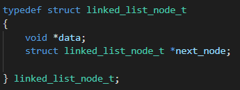
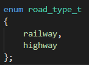
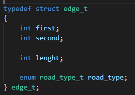
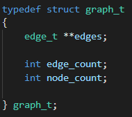
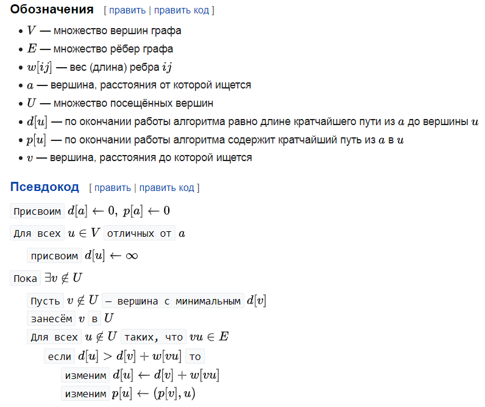

# Отчет по ЛР-7

### Вариант 22.

#### Хетагуров Павел Иу7-35Б

### 1. Описание условия задачи

**Цель:** Цель работы – получить навыки применения двоичных деревьев,
реализовать основные операции над деревьями: обход деревьев, включение,
исключение и поиск узлов; построить и обработать хеш-таблицы, сравнить
эффективность поиска в сбалансированных деревьях, в двоичных деревьях
поиска и в хеш-таблицах.


**Условие задачи:** Заданы две системы двухсторонних дорог с одним и тем же множеством городов (железные и шоссейные дороги). Найти минимальный по длине путь из города A в город B, к
оторый может проходить как по железной так и по шоссейной дорогам, и места пересадок с одного вида транспорта на другой на этом пути.

#### ТЗ и внешняя спецификация

**Исходные данные и результаты (типы, форматы, способ передачи, ограничения):**
**Исходные данные**:

1. Файл ```graph.txt``` с указанием кол-ва городов и описанием дорог.
2. Стартовый и конечный узел для поиска дороги между ними
**Способ передачи**: Файл должен находиться в директории с программой, ввод номеров узлов с клавиатуры

**Ограничения**:
1. Корректность данных в файле не проверяется
2. Узлы нумеруются с еденицы

**Выходные данные:**

Файл ```OutputGraph.png``` (картинка графа с отмеченным пересадочными узлами и путем)

**Способ обращения к программе**: Запуск app.exe, ввод с клавиатуры

**Описание возможных аварийных ситуаций и ошибок пользователя:**

1. Некорректный ввод номеров узлов.

### 2.Описание внутренних структур данных

**Описание полей**
Узел используется для списка

* .data - указатель на данные
* .next_node - указатель на следующий узел
Данная структура выбранна, так как является базовой для списка.

Список

* .head  - Указатель на голову списка. (Под головой понимается первый элемент)
* .tail - Указатель на хвост стека. (Под хвостом понимается последний добавленный элемент)
* .size - Кол-во элементов. (Кол-во элементов позволяет легче обрабатывать список. Хотя в общем случае можно ориентироваться на нулевой указатель)

Тип дороги

* railway - Железная дорога (0)
* highway - Шоссейная дорога (1)
Тип данных определен, так как позволяет нагляднее хранить тип дороги

Ребро

* .first - Начальный узел ребра
* .second - Конечный узел ребра
* .lenght - Вес ребра
* .road_type - Тип дороги
Так как граф неориентирован, разделение на начальный и конечный узел - условно

Граф представляется в виде массива ребер, так как такое представление удобно для алгоритма Дейкстры.

* .edges - Массив ребер
* .edge_count - Кол-во ребер
* .node_count - Кол-во узлов

#### 3. Алгоритм.

Для нахождения минимального по длине пути используется алгоритм Дейкстры, но при успешном уменьшении метки пути, запоминается ребро, по которому метка уменьшилась. Таким образом после выполнения алгоритма получен список из ребер, являющихся путем.
Описание алгоритма:


### 4. Тесты
|  Исходные данные |  Выходные |  Описание теста |
| --- | --- | --- |
| Граф с циклом | Пути ищются корректно |  Проверка построения |
| Граф с петлями | Пути ищются корректно | Проверка построения |
| Недостижимая вершина  | ПWay doesnt exist | Проверка алгоритма |
| Путь из вершины в саму себя | Граф без отмеченных ребер | Проверка алгоритма |

### 5. Вывод

**Вывод** : Представление графа в виде массива ребер выгоднее, чем представление в виде матрицы смежности, так как не используется дополнительная память (для хранения меток несуществующих путей) и время на их просмотр всей матрицы.
Существуют разные алгоритмы поиска путей в графе, но алгоритм Дейкстры достаточно прост и эффективен (при различных реализация худшая сложность - O(n^2), лучшая - O(n*log(n) + m), где n - число узлов, m - число ребер).

### 5. Вопросы
1. **Что такое граф?**
Граф - множество вершин(узлов) и связей между ними(ребер, дуг)
2. **Как представляются графы в памяти?**
Могут представляться несколькими способами:
 * Матрица смежности
 * Список ребер
 * Список смежности
3. **Какие операции возможны над графами?**
•	обход графа в глубину
•	обход графа в ширину
•	поиск эйлерова пути
•	поиск гамильтонова пути
•	поиск остова
•	поиск подграфа
•	поиск кратчайшего пути от одной вершины к другой.
•	поиск кратчайшего пути от одной вершины ко всем другим
•	поиск кратчайших путей между всеми вершинами
и др.
4. **Какие способы обхода графов существуют?**
Обход в глубину, обход в ширину.
5. **Где используются графовые структуры?**
Там, где природа данных подразумевает связи между ними
Например: логистика, БД, социальные сети и др.
6. **Какие пути в графе Вы знаете?**
Контур: замкнутый путь в ориентированном графе.
Простой путь: каждая из вершин графа встречается не более одного раза.
Эйлеров путь: каждое ребро встречается ровно один раз.
Гамильтонов путь: каждая вершина встречается ровно один раз.
7. **Что такое каркасы графа?**
Каркас графа — множество ребер, соединяющие все вершины графа